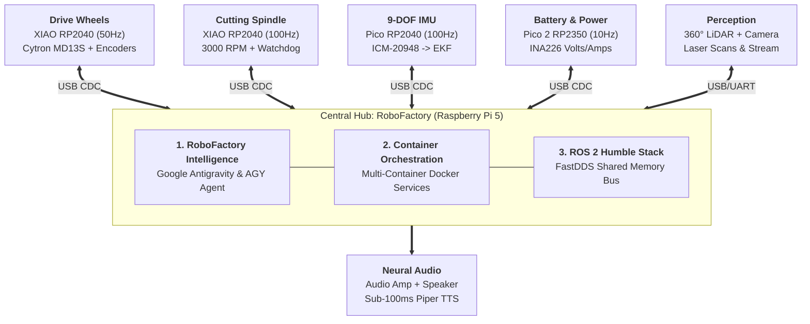

<!-- Slide 1 -->
# ReloBot
## Next-Gen Autonomous Robotics Platform
*Distributed micro-ROS, Containerized ROS 2 & On-Device AI Agent*

<span class="badge">ROS 2 Humble</span>
<span class="badge">micro-ROS</span>
<span class="badge">Multi-Container Orchestration</span>
<span class="badge">Antigravity AI</span>
<span class="badge">Piper Neural TTS</span>
<span class="badge">DarkSelmash Cyber-Trim</span>

<div style="text-align: center; margin: 16px 0;">
  
</div>

**Presented by: DarkSelmash AI Factory**

<!-- 
[SPEAKER NOTES - RU | 0:00 - 0:45]
Всем привет! Рады приветствовать вас на DarkSelmash AI Factory. Сегодня мы представляем проект ReloBot. Это не просто радиоуправляемая тележка или самодельная косилка, а полноценная автономная робототехническая платформа. Наш ключевой фокус сегодня — объединение классической надежной робототехники на ROS 2 с концепцией AI Factory: когда искусственный интеллект встроен непосредственно в рантайм робота, способен общаться голосом и анализировать систему изнутри.
-->

---

<!-- Slide 2 -->
## Hardware Architecture: Hub & Spoke Network
*Dedicated micro-ROS agents radiating from the central RoboFactory compute hub*



> **Hardware Rule**: Microseconds to Microcontrollers (PWM, Encoders, Safety) | Milliseconds to Central Hub (RoboFactory, Container Orchestration, AGY).

<!-- 
[SPEAKER NOTES - RU | 0:45 - 2:15]
В основе аппаратной архитектуры ReloBot лежит концепция Hub and Spoke. Центральным хабом выступает Raspberry Pi 5 с 8 гигабайтами оперативной памяти. Важнейшая деталь: прямо внутри хаба развернута среда RoboFactory, запускающая Google Antigravity и агентский рантайм AGY. Чат для оператора — это лишь маленькая входная фича, а само ядро AGY мы активно расширяем для автономной работы и диагностики. От хаба, как спицы колеса, расходятся изолированные каналы к микро-агентам: два модуля XIAO RP2040 для привода и ножей на 3000 оборотов, Pico с 9-осевым IMU, Pico 2 на RP2350 с чипом INA226 для батареи, круговой лидар и динамик голосового вывода.
-->

---

<!-- Slide 3 -->
## Software Architecture & Digital Twin
*Pure ROS 2 containerization paired with exact Gazebo simulation parity*

<div class="grid-2">
  <div class="card">
    <h3>Multi-Container Orchestration</h3>
    <ul>
      <li><code>network_mode: host</code> & <code>ipc: host</code> (Zero latency)</li>
      <li>Host is pure orchestrator (Zero host pollution)</li>
      <li>Live volume mounts for web UI and robot configs</li>
      <li>Standard <code>topic_based_ros2_control</code> & EKF fusion</li>
    </ul>
  </div>
  <div class="card">
    <h3>Zero-Risk Gazebo Digital Twin</h3>
    <ul>
      <li>100% API parity: Identical topics, TF tree & Nav2 configs</li>
      <li>Virtual worlds: <code>garden.sdf</code> (lawn friction, trees) & obstacles</li>
      <li>Simulated 360° laser scan, camera feed, and spindle mock</li>
      <li>One-command launcher: <code>./start_sim.sh up --gui --dev</code></li>
    </ul>
  </div>
</div>

```
[micro-ROS MCUs] <==USB CDC==> [ros2_control] <==> [EKF Fusion] <==> [Nav2 Stack] <==> [Web UI]
```

<!-- 
[SPEAKER NOTES - RU | 2:15 - 3:45]
Программный стек и симуляция образуют единый конвейер с нулевым загрязнением хост-системы. Все ноды ROS 2 Humble работают в мультиконтейнерной системе Docker с общей памятью IPC. При этом мы создали цифровой двойник ReloBot в симуляторе Gazebo с абсолютным, стопроцентным паритетом API. Топики, TF-дерево и алгоритмы навигации Nav2 работают в симуляторе точно так же, как на реальном газоне, позволяя отладить весь софт на ноутбуке до раскрутки металлических ножей.
-->

---

<!-- Slide 4 -->
## RoboFactory Intelligence: The Self-Aware Robot
*Antigravity (AGY) core inside RoboFactory — Chat is just the gateway; AGY is our extensible agent engine*

<div class="grid-2">
  <div class="card">
    <h3>RoboFactory AGY Agent Platform</h3>
    <ul>
      <li>Runs locally inside <code>ros2_voice_chat</code> container</li>
      <li>Full introspection: Direct read-access to node status, telemetry, configs, and logs</li>
      <li><strong>Chat is just the gateway</strong>: Natural language UI for operator; core engine handles diagnostics</li>
      <li><strong>Extending AGY</strong>: Evolving to auto-healing, node recovery & swarm coordination</li>
    </ul>
  </div>
  <div class="card">
    <h3>Piper Neural TTS & Voice Pipeline</h3>
    <ul>
      <li>Sub-100ms local neural voice generation (Zero cloud reliance)</li>
      <li>Pipelined sentence & clause-level token streaming</li>
      <li>Concurrent audio output: Onboard speaker + Web Audio</li>
      <li>Razor-sharp robotics engineering persona</li>
    </ul>
  </div>
</div>

```
[Operator (UI/Voice)] ──> [RoboFactory Gateway] ──> [Antigravity AGY Core] ──> [System Actions + Piper TTS]
```

<!-- 
[SPEAKER NOTES - RU | 3:45 - 5:15]
Ядро концепции DarkSelmash AI Factory — среда RoboFactory и агент AGY на базе Google Antigravity, запущенные прямо на борту робота. Хочу подчеркнуть: чат в браузере — это лишь маленькая входная фича для человека. Настоящая сила в том, что Antigravity работает как расширяемый агентский движок с доступом к топикам, логам, файлам и состоянию всех нод. Мы расширяем AGY дальше: агент учится самостоятельно перезапускать сбойные процессы, диагностировать аппаратные ошибки и в будущем координировать роевые миссии. А локальный нейросетевой движок Piper TTS озвучивает мысли робота с задержкой менее 100 миллисекунд.
-->

---

<!-- Slide 5 -->
## LIVE DEMO: Telemetry, Control & AI Voice
*Real-time inspection of ReloBot via Browser Dashboard*

1. **Dashboard Telemetry**: Live INA226 battery voltage, 9-DOF IMU attitude
2. **Manual Drive**: Virtual joystick commands directly to differential drive
3. **Mower Control**: Closed-loop blade spindle RPM activation
4. **AI Voice Query**:
   > *"ReloBot, report system status and battery voltage"*
5. **Real-time Neural Speech**: Piper TTS streaming response

🔗 **Dashboard URL**: `http://localhost/`

<!-- 
[SPEAKER NOTES - RU | 5:15 - 8:45]
ДЕМО В ЭФИРЕ: Переключаемся на браузер с дашбордом оператора (Alt+Tab). В правом верхнем углу — живая телеметрия с INA226 и наклоны робота. Касаемся джойстика — дифференциальный привод откликается мгновенно. Задаем обороты шпинделя ножей. А теперь обращаемся к бортовому ИИ: 'ReloBot, report system status and battery voltage'. Слушаем локальный голос робота через Piper TTS: 'All subsystems nominal. Battery at 12.4 volts. Ready for autonomous operation.' Голос сгенерирован полностью на борту!
-->

---

<!-- Slide 6 -->
## Field Engineering: Solved Hard Problems
*Real-world engineering triumphs from active development*

- **FastDDS UDP Buffer Storm**:
  - Default Linux UDP buffer (212 KB) dropped dense costmaps, triggering CPU interrupt storms (`si`).
  - *Fix*: Optimized host socket buffers to **64 MB** (`net.core.rmem_max = 67108864`).
- **Wheel Velocity & Stiction Calibration**:
  - Automated velocity sweeps & linear regression ($PWM = k \cdot v + b$) in firmware to eliminate motor deadbands.
- **5 GHz Wi-Fi on Raspberry Pi 5**:
  - Unlocked regulatory domain (`country PL`) enabling 5 GHz DFS Channel 52 for zero-lag video streaming.
- **AI Agent Session Lifecycle & TTFT Latency**:
  - Dynamic session tracking, `<think>` token suppression (<50ms TTFT), and RAM model pre-warming.

<!-- 
[SPEAKER NOTES - RU | 8:45 - 10:15]
Робототехника — это искусство борьбы с физикой и граблями. Мы решили шторм буфера FastDDS, когда тяжелые карты SLAM забивали 200-килобайтный буфер Linux и вешали ядро — помог тюнинг сокетов до 64 МБ. Мы победили трение покоя моторов через калибровочную регрессию прямо на RP2040. Разблокировали 5 ГГц Wi-Fi на Pi 5 для видеопотока. И оптимизировали работу агента Antigravity: подавили задержку reasoning-токенов с 20 секунд до 50 миллисекунд и прогрели граф нейросети в RAM.
-->

---

<!-- Slide 7 -->
# DarkSelmash AI Factory: Vision & Discussion
## Toward Autonomous Swarm Factory

<div class="grid-2">
  <div class="card">
    <h3>Next Milestones</h3>
    <ul>
      <li><strong>🎯 Precision Optical Docking</strong>: Sub-centimeter AprilTag auto-docking for recharging</li>
      <li><strong>🌱 Systematic Coverage</strong>: Boustrophedon and spiral mowing via <code>opennav_coverage</code></li>
      <li><strong>🤖 Swarm Fleet Coordination</strong>: Multi-robot shared spatial maps and central dispatch</li>
      <li><strong>🛠️ Supervised Self-Healing</strong>: Autonomous container recovery & PID auto-tuning</li>
    </ul>
  </div>
  <div class="card">
    <h3>Q&A & Discussion</h3>
    <ul>
      <li><strong>Hardware</strong>: Deterministic micro-ROS Hub & Spoke network</li>
      <li><strong>Software</strong>: 100% Dockerized ROS 2 + Gazebo digital twin</li>
      <li><strong>Intelligence</strong>: On-device Antigravity AI + Piper neural voice</li>
      <li><strong>Web Dashboard</strong>: <code>http://localhost/</code></li>
    </ul>
  </div>
</div>

### We are ready for your questions!

<!-- 
[SPEAKER NOTES - RU | 10:15 - 12:00]
Куда мы движемся дальше? Наш ближайший шаг — автономная док-станция с оптической стыковкой по меткам AprilTag, алгоритмы сплошного покоса и объединение роботов в координированный рой под управлением диспетчера AI Factory. Большое спасибо за внимание! Мы открыты к вопросам и технической дискуссии.
-->
