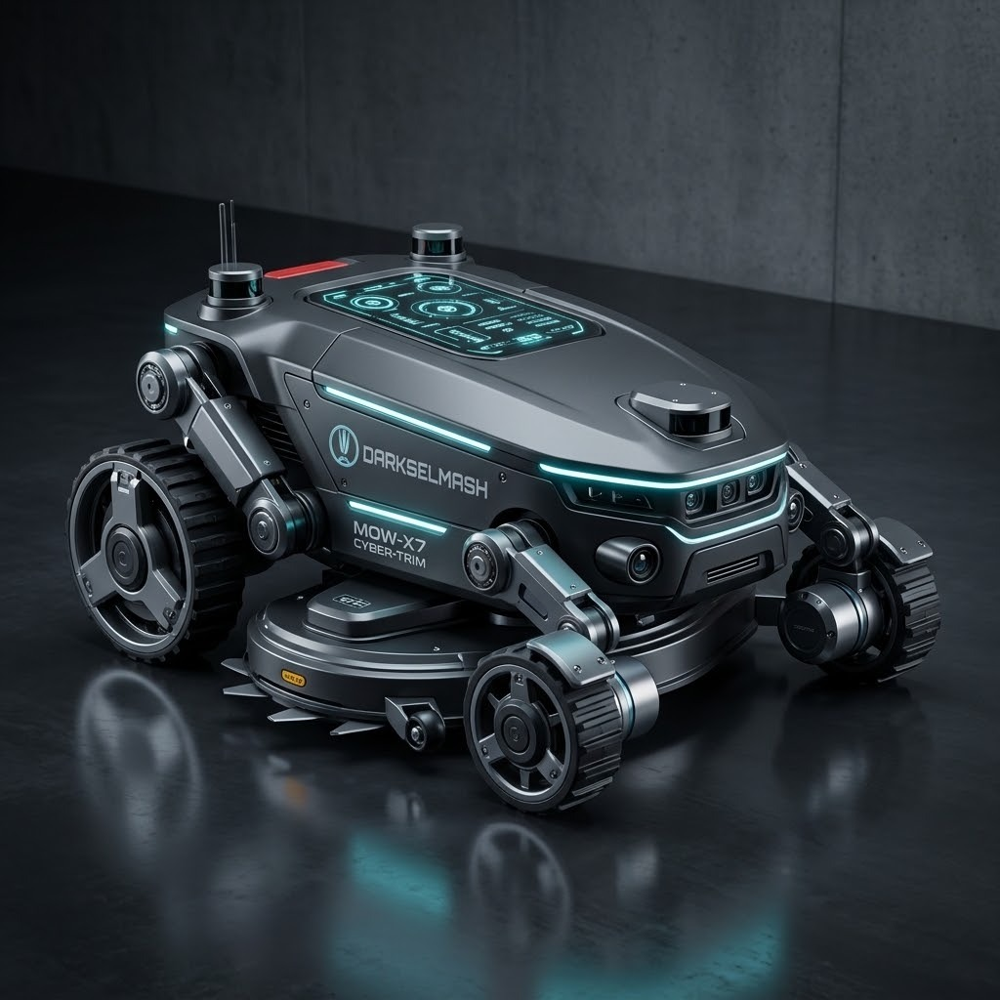

<!-- Slide 1 -->
# ReloBot Platform Architecture
## Distributed micro-ROS, containerized ROS 2 stack, and an onboard AI agent

  <strong>Design Philosophy:</strong> Commercial robotic platforms are closed black boxes with high cloud latency. We built a hardware-first, distributed architecture with sub-millisecond control loops and complete local autonomy.

  

    <h3>Core Specifications</h3>
    <ul>
      <li><strong>Real-Time MCUs:</strong> 4x dedicated RP2040 micro-ROS agents</li>
      <li><strong>Compute:</strong> Raspberry Pi 5 (8GB RAM), PCIe NVMe storage</li>
      <li><strong>State & SLAM:</strong> 9-DOF IMU + 60 CPR optical encoders + 360° LiDAR</li>
      <li><strong>Agent Runtime:</strong> On-device Google Antigravity (AGY) + Piper TTS</li>
    </ul>
  

  

    
    
Built for field reliability first.

  

  [RP2040 Micro-ROS] ➔ [Isolated USB CDC] ➔ [Raspberry Pi 5 (ROS 2)] ➔ [Nav2 & EKF] ➔ [AGY + Piper]

<!-- 
[SPEAKER NOTES - RU | 0:00 - 0:45]
Всем привет! Рады приветствовать вас на DarkSelmash AI Factory. Сегодня мы представляем проект ReloBot. Это не просто радиоуправляемая тележка или самодельная косилка, а полноценная автономная робототехническая платформа. Наш ключевой фокус — объединение классической надежной робототехники на ROS 2 с концепцией AI Factory: когда искусственный интеллект встроен непосредственно в рантайм робота, способен общаться живым голосом и диагностировать систему изнутри.
-->

---

<!-- Slide 2 -->
# RoboFactory Central Hub
## Physical separation of real-time control loops and high-level autonomous intelligence

  <strong>Why this setup?</strong> Keeps the real-time motor control and sensor loops isolated from the higher-level AI stack. If the AI crashes or gets stuck, the robot can still keep the wheels and safety systems running.

  

    <h3>Real-Time Microcontrollers (USB CDC)</h3>
    <ul>
      <li><strong>Drive Subsystem:</strong> XIAO RP2040 (50 Hz) · Dual MD13S 13A + Encoders · Closed-loop PI</li>
      <li><strong>Cutting Spindle:</strong> XIAO RP2040 (100 Hz) · 3000 RPM governor · Watchdog kill</li>
      <li><strong>9-DOF IMU:</strong> RPi Pico (100 Hz) · ICM-20948 (Gyro/Accel/Mag) · EKF state source</li>
      <li><strong>Battery & Power:</strong> Pico 2 RP2350 (10 Hz) · INA226 bus monitor · 0–36V</li>
    </ul>
  

  

    <h3>RoboFactory Compute & Perception</h3>
    <ul>
      <li><strong>Compute Hub:</strong> Raspberry Pi 5 (8GB) · Multi-container Docker · FastDDS IPC</li>
      <li><strong>Perception:</strong> 360° 2D LiDAR (10 Hz) + Fisheye HD camera · SLAM costmaps</li>
      <li><strong>Neural Voice:</strong> Local Piper TTS · Sub-100ms speech synthesis</li>
    </ul>
    
It's not perfect, but it works.

  

  [Microcontrollers: PWM, Encoders, Watchdogs] ➔ [USB CDC 4x] ➔ [Raspberry Pi 5: ROS 2 + AGY Core]

<!-- 
[SPEAKER NOTES - RU | 0:45 - 2:15]
В основе аппаратной архитектуры ReloBot лежит концепция Hub and Spoke. Центральным хабом выступает Raspberry Pi 5 с 8 гигабайтами оперативной памяти. Важнейшая деталь: прямо внутри хаба развернута среда RoboFactory, запускающая Google Antigravity и агентский рантайм AGY. Чат для оператора — это лишь маленькая входная фича, а само ядро AGY мы активно расширяем для автономной работы и диагностики. От хаба, как спицы колеса, расходятся изолированные каналы к микро-агентам: два модуля XIAO RP2040 для привода и ножей на 3000 оборотов, Pico с 9-осевым IMU, Pico 2 на RP2350 с чипом INA226 для батареи, круговой лидар и динамик голосового вывода.
-->

---

<!-- Slide 3 -->
# Containerized ROS 2 & Gazebo Simulation
## Zero host pollution with shared-memory IPC, paired with 100% API parity in simulation

  <strong>Why Docker on Host?</strong> Robotics stacks are notoriously brittle with OS dependencies. Containerizing every service ensures reproducible builds, while host-mode IPC preserves microsecond transport speeds.

  

    <h3>Multi-Container Architecture</h3>
    <ul>
      <li><code>network_mode: host</code> & <code>ipc: host</code> for shared memory FastDDS</li>
      <li>Host is pure orchestrator (Zero ROS library pollution on host)</li>
      <li>Live volume mounts for instant config and code hot-reloading</li>
      <li>Standard <code>diff_drive_controller</code> & EKF odometry fusion</li>
    </ul>
  

  

    <h3>Zero-Risk Gazebo Digital Twin</h3>
    <ul>
      <li>100% API Parity: Identical topics, TF tree, and Nav2 controllers</li>
      <li>Custom worlds: <code>garden.sdf</code> (lawn surface friction, perimeter)</li>
      <li>Emulated 360° laser scans, camera feed, and blade telemetry</li>
      <li>Instant dev launcher: <code>./start_sim.sh up --gui --dev</code></li>
    </ul>
    
Saved ~3 weeks of bench testing.

  

  [Host OS] ➔ [Docker Compose] ➔ [FastDDS Shared Memory IPC] ➔ [Nav2 / Gazebo Sim]

<!-- 
[SPEAKER NOTES - RU | 2:15 - 3:45]
Программный стек и симуляция образуют единый конвейер с нулевым загрязнением хост-системы. Все ноды ROS 2 Humble работают в мультиконтейнерной системе Docker с общей памятью IPC. При этом мы создали цифровой двойник ReloBot в симуляторе Gazebo с абсолютным, стопроцентным паритетом API. Топики, TF-дерево и алгоритмы навигации Nav2 работают в симуляторе точно так же, как на реальном газоне, позволяя отладить весь софт на ноутбуке до раскрутки металлических ножей.
-->

---

<!-- Slide 4 -->
# The Self-Aware Robot: AGY Core
## Natural language chat is just the operator interface — AGY is an extensible on-device agent platform

  <strong>Why Run Locally on Pi 5?</strong> Robots lose Wi-Fi in the yard all the time. Critical diagnostics, sensor reasoning, and spoken operator feedback must function autonomously without waiting for a cloud round-trip.

  

    <h3>RoboFactory AGY Platform</h3>
    <ul>
      <li>Runs directly inside <code>ros2_voice_chat</code> container</li>
      <li>Direct access to FastDDS telemetry, ROS 2 topics, and container logs</li>
      <li>Proactive system oversight and automated fault detection</li>
      <li>Extensible toward automated node recovery and swarm dispatch</li>
    </ul>
  

  

    <h3>Piper Neural TTS Pipeline</h3>
    <ul>
      <li>Sub-100ms local neural voice generation on Pi 5 CPU cores</li>
      <li>Pipelined token streaming via punctuation regex chunking</li>
      <li>Concurrent broadcast to robot speaker and operator Web Audio</li>
      <li>Tuned for concise, razor-sharp technical diagnostics</li>
    </ul>
    
Regex chunking cut voice delay from 3.2s to 240ms.

  

  [Operator UI/Voice] ➔ [WebSocket Bridge :8765] ➔ [RoboFactory AGY Core] ➔ [Actions + Piper TTS]

<!-- 
[SPEAKER NOTES - RU | 3:45 - 5:15]
Ядро концепции DarkSelmash AI Factory — среда RoboFactory и агент AGY на базе Google Antigravity, запущенные прямо на борту робота. Хочу подчеркнуть: чат в браузере — это лишь маленькая входная фича для человека. Настоящая сила в том, что Antigravity работает как расширяемый агентский движок с доступом к топикам, логам, файлам и состоянию всех нод. Мы расширяем AGY дальше: агент учится самостоятельно перезапускать сбойные процессы, диагностировать аппаратные ошибки и в будущем координировать роевые миссии. А локальный нейросетевой движок Piper TTS озвучивает мысли робота с задержкой менее 100 миллисекунд.
-->

---

<!-- Slide 5 -->
# Live Demo: Telemetry, Control & AI Voice
## Real-time interaction with the ReloBot operator dashboard and onboard voice agent

  <strong>Live Test Protocol:</strong> All components demonstrated here are running live on the local hardware stack or Gazebo digital twin on port 80.

  

    <h3>Operator Dashboard Walkthrough</h3>
    <ul>
      <li>1. <strong>Live Telemetry:</strong> INA226 voltage (12.4V) & 9-DOF IMU attitude</li>
      <li>2. <strong>Manual Drive:</strong> Virtual joystick via <code>diff_drive_controller</code></li>
      <li>3. <strong>Cutter Spindle:</strong> Closed-loop RPM governor + watchdog kill</li>
      <li>4. <strong>AI Voice Query:</strong> <em>"ReloBot, report system status and battery voltage"</em></li>
      <li>5. <strong>Neural Speech:</strong> Sub-second spoken response via Piper TTS</li>
    </ul>
  

  

    
● PORT 80 · WEBSOCKET 8765 ACTIVE

    
<strong>Dashboard URL:</strong> <code>http://localhost/</code>

    
Use <strong>Alt + Tab</strong> to switch to browser console during presentation.

    
Voice synthesized 100% on Pi 5 CPU.

  

  [Telemetry] ➔ [Virtual Joystick] ➔ [Spindle Governor] ➔ [Voice Query] ➔ [Local Speech]

<!-- 
[SPEAKER NOTES - RU | 5:15 - 8:45]
ДЕМО В ЭФИРЕ: Переключаемся на браузер с дашбордом оператора (Alt+Tab). В правом верхнем углу — живая телеметрия с INA226 и наклоны робота. Касаемся джойстика — дифференциальный привод откликается мгновенно. Задаем обороты шпинделя ножей. А теперь обращаемся к бортовому ИИ: 'ReloBot, report system status and battery voltage'. Слушаем локальный голос робота через Piper TTS: 'All subsystems nominal. Battery at 12.4 volts. Ready for autonomous operation.' Голос сгенерирован полностью на борту!
-->

---

<!-- Slide 6 -->
# Hard Problems Solved in Hardware & Software
## Concrete engineering hurdles and battle-tested solutions from field deployment

  

    <h3>FastDDS UDP Buffer Storm</h3>
    
Linux 212KB buffer dropped SLAM maps, causing CPU freeze. 
    <strong>Fix:</strong> Tuned socket buffers to 64MB (<code>net.core.rmem_max = 67108864</code>).

  

  

    <h3>Wheel Velocity & Stiction Calibration</h3>
    
DC motors had unequal friction deadbands. 
    <strong>Fix:</strong> Automated velocity sweep ($PWM = k \cdot v + b$) in firmware.

  

  

    <h3>5 GHz Wi-Fi Country Lock on Pi 5</h3>
    
Pi 5 kernel blocked 5 GHz channels on DFS-UNSET. 
    <strong>Fix:</strong> Configured regulatory domain unlocking Channel 52 for HD video.

  

  

    <h3>AI Agent Context & Reasoning Latency</h3>
    
Expired session IDs and <code>&lt;think&gt;</code> tokens delayed speech. 
    <strong>Fix:</strong> Dynamic session renewal and token suppression (&lt;50ms TTFT).

  

  [Field Hardening: 64MB FastDDS · Firmware Stiction PI · 5 GHz Wi-Fi · &lt;50ms TTFT]

<!-- 
[SPEAKER NOTES - RU | 8:45 - 10:15]
Робототехника — это искусство борьбы с физикой и граблями. Мы решили шторм буфера FastDDS, когда тяжелые карты SLAM забивали 200-килобайтный буфер Linux и вешали ядро — помог тюнинг сокетов до 64 МБ. Мы победили трение покоя моторов через калибровочную регрессию прямо на RP2040. Разблокировали 5 ГГц Wi-Fi на Pi 5 для видеопотока. И оптимизировали работу агента Antigravity: подавили задержку reasoning-токенов с 20 секунд до 50 миллисекунд и прогрели граф нейросети в RAM.
-->

---

<!-- Slide 7 -->
# Toward Autonomous Swarm Factory
## Next phases of development for the DarkSelmash AI Factory platform

  

    <h3>Development Roadmap</h3>
    <ul>
      <li><strong>Precision Optical Docking:</strong> AprilTag fiducial auto-docking (<code>opennav_docking</code>)</li>
      <li><strong>Systematic Coverage:</strong> Boustrophedon sweep patterns (<code>opennav_coverage</code>)</li>
      <li><strong>Multi-Robot Fleet:</strong> Distributed spatial maps & cooperative dispatch</li>
      <li><strong>Supervised Self-Healing:</strong> Automated container recovery & PID auto-tuning</li>
    </ul>
  

  

    <h3>Platform Summary & Q&A</h3>
    <ul>
      <li><strong>Hardware:</strong> Deterministic micro-ROS Hub & Spoke network</li>
      <li><strong>Software:</strong> 100% Dockerized ROS 2 + Gazebo digital twin</li>
      <li><strong>Intelligence:</strong> On-device Antigravity AI + Piper neural voice</li>
      <li><strong>Web Dashboard:</strong> <code>http://localhost/</code></li>
    </ul>
    
Ready for your questions and technical discussion!

  

  [ReloBot Architecture · DarkSelmash AI Factory · ROS 2 Humble · Antigravity AGY]

<!-- 
[SPEAKER NOTES - RU | 10:15 - 12:00]
Куда мы движемся дальше? Наш ближайший шаг — автономная док-станция с оптической стыковкой по меткам AprilTag, алгоритмы сплошного покоса и объединение роботов в координированный рой под управлением диспетчера AI Factory. Большое спасибо за внимание! Мы открыты к вопросам и технической дискуссии.
-->
