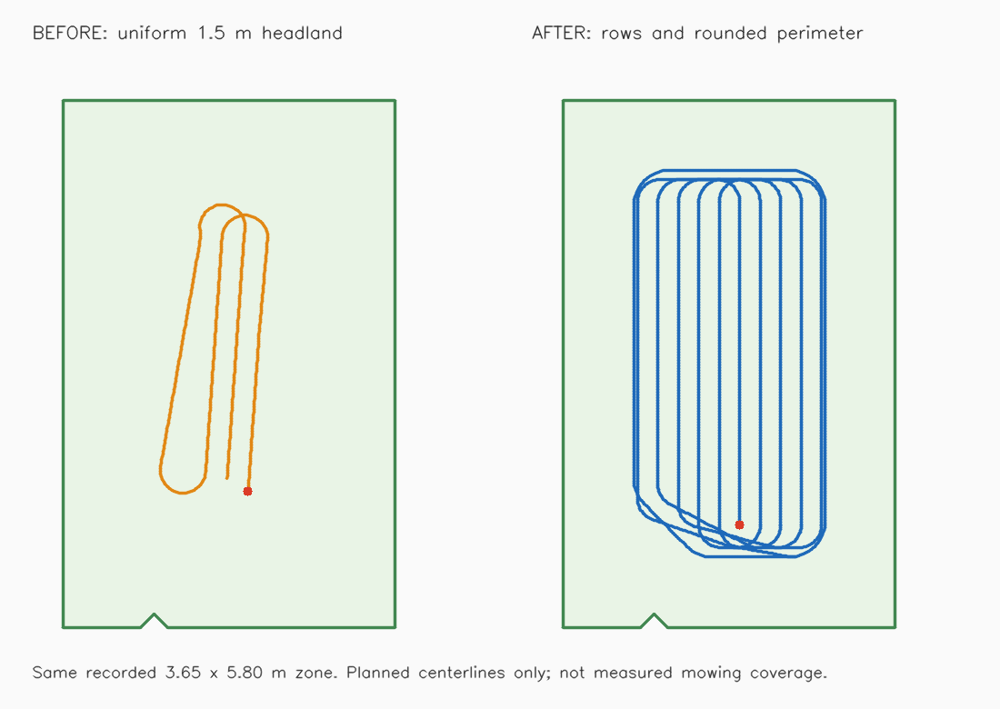

# Gazebo Coverage Baseline: 2026-09-30

For reusable test/analysis commands and the decisions index, see the
[Navigation Tuning Lab](../helpers/navigation_diagnostics/README.md).
This report retains the chronological evidence, including rejected approaches.

Capture: `ros2_ws/log/navigation/20260930T062841Z-coverage-baseline-762833`.
The robot and controller configuration were unchanged during this baseline.
Coverage was already executing when recording began; the capture includes its
successful completion, not the entire mission. The recorder was stopped manually.

## Measured Results

| Measurement | Result |
| --- | --- |
| Recorded wall / simulation interval | 69.86 s / 71.94 s |
| Diagnostic samples | 684 |
| Valid path-tracking samples | 682 |
| Absolute cross-track error, p95 / maximum | 0.0804 m / 0.1110 m |
| Incoming `/plan` updates | 51 |
| Raw controller stationary-turn episodes | 12 |
| Raw controller stationary-turn time | 20.31 simulated seconds |
| Smoothed stationary-turn time | 17.99 simulated seconds |
| Maximum commanded angular speed | 1.50 rad/s |
| Commanded reverse samples | 0 |
| Minimum filtered longitudinal velocity | Approximately -0.016 m/s |
| Recovered lidar scans | 639 |
| Minimum observed lidar-to-footprint clearance | 0.8773 m |
| Recovered scans below 0.20 m observed clearance | 0 |
| Controller rate warnings in captured console log | 3 |
| New `Spin` recovery transitions during capture | 0 |
| Coverage action result | Succeeded |

Motion durations are integrated over consecutive diagnostic sample timestamps,
not inferred from action status counts. About 31% of valid raw command samples
requested stationary rotation. Small negative filtered velocities during rotations
split the measured-motion classification into 27 stationary-turn entries and 16
reverse entries; these are not 27 commanded spins or 16 reverse maneuvers.

## Loaded Configuration

The live parameter snapshot confirms `FollowPath` is a RotationShimController
wrapping RegulatedPurePursuitController. Both heading-alignment settings are
enabled; the angular threshold is 0.785 rad and requested rotation speed 1.5 rad/s.
Desired linear speed and minimum goal-approach speed are both 0.30 m/s; curvature
and obstacle regulation have a 0.18 m/s floor. The velocity smoother runs at
10 Hz, clamps linear velocity to [0.0, 0.3], and has `scale_velocities=false`.
The local footprint has 0.01 m padding, not the proposed 0.20 m clearance margin.

The coverage implementation requests swaths without connection paths, converts
them to endpoints, and replans through those endpoints. Its continuous-turn
configuration therefore does not produce the executed geometry. The recorded
path updates and repeated alignment commands support correcting this contract
before selecting controller gains.

There are 50 observed `FollowPath` transitions from executing to aborted while
new goals replace old ones, followed by a successful final goal. The console
records repeated "Passing new path to controller", not 50 recovery failures.
Retained action-status history also includes goals predating this recording.
Do not count those statuses as independent failed missions. The exact division
between shim alignment and RPP alignment is not established by this info-level log.

## Recorder Correction

The original summary's clearance is null because the recorder treated the
upside-down lidar mounting as a tilted scan plane. Recorded `/tf_static` confirms
`base_link -> base_laser` translation [0.15, 0.0, 0.18] with an inverted but
horizontal scan plane. The corrected calculation uses the quaternion's full
planar rotation/reflection and translation, including the asymmetric footprint.
Genuinely tilted scan planes are still rejected.

All 639 saved scans were reprocessed read-only using that recorded static
transform and the captured, unpadded local-costmap footprint. The minimum is
0.8773 m at ROS time 288.1 s. Original capture files were not overwritten.
Regression tests cover upright, inverted, rotated-inverted and tilted lidar
mounts; all 23 diagnostic tests pass in the isolated Humble container image.

## Interpretation and Next Change

1. Correct coverage execution to preserve and validate generated continuous
   forward turns. Do not attempt to eliminate geometrically necessary heading
   changes solely by lowering a rotation threshold or increasing speed floors.
2. Use the planned MPPI arc-constrained profiles only with compatible, validated
   routes and consistent downstream command limits. Keep clearance/collision
   checking enabled. No live controller parameters were changed in this review.
3. Test close-obstacle exploration separately. This run has ample observed
   clearance and does not reproduce or validate the reported close passes.

Cross-track errors refer to the ordered local window of the replanned `/plan`,
not the original swath centerlines or measured coverage completeness. Lidar
clearance says nothing about occluded obstacles, nonplanar objects or independent
Gazebo ground truth. Neither coverage success nor this capture establishes that
all strips were covered or that the 0.20 m clearance target is enforced.

## Continuous-Coverage Trial Follow-Up

Capture: `ros2_ws/log/navigation/20260930T075941Z-coverage-continuous-v1-d963f0`.
Outcome: **failed during ingress, before reaching the first coverage row**.
Analysis used the saved JSON samples/events, parameter snapshot, console log and
read-only rosbag decoding inside Docker. No services, goals or parameters were
changed during analysis; the original recording was not modified.

The recorder ran for about 139 wall seconds and was stopped by the operator.
At its first execution event the route was already active, at 0.46 m progress.
The first ingress-planning request and initial motion are therefore not captured.

| Measurement | Result |
| --- | --- |
| Combined ingress and coverage path | 477 poses / 16.8744 m |
| First coverage-row start along combined path | Approximately 3.6899 m |
| Last executor progress before abort | 3.2906 m, path index 40 |
| Remaining route at abort | 13.5839 m |
| Controller abort reason | `Failed to make progress` |
| Active execution tracking samples | 603 |
| Active cross-track error p95 / maximum | 0.0628 m / 0.0691 m |
| Active minimum observed lidar-to-body clearance | 1.0666 m |
| Recorded raw / smoothed commands before abort | 1136 / 1130 |
| Stationary-turn or reverse commands in that bag interval | 0 / 0 |
| Controller rate warnings in captured console log | 22 |

The robot approached the turning section, then crawled at roughly 0.007-0.012 m/s
instead of completing the ingress turn. The progress watchdog aborted the action
at ROS time 1895.275 s. The manager reported `blocked`; it did not complete the
route or launch recovery spins. Nine diagnostic odometry samples were classified
as stationary turning (about 0.71 simulated seconds), but recorded commands did
not meet the stationary-turn threshold. These classifications are not evidence
of a deliberate in-place-turn maneuver.

One raw command at ROS time 1873.26 s was v=0.0372998193 m/s,
w=-0.1974193603 rad/s: radius 0.188937 m, below the configured 0.20 m limit.
The smoother passed the same command at 1873.275 s. This exceeds the test envelope
even allowing 0.01 rad/s tolerance; the earlier synthetic U-turn test did not
establish a universal command-radius guarantee.

Two later `execute` commands replanned ingress but were rejected before another
FollowPath submission. Their planner endpoint was (-5.24804035, -3.16423183),
heading 1.48353 rad, while the coverage start was (-5.24333301, -3.17458057),
heading 1.50104 rad. Appending the exact start introduced an approximately
1.14 cm backward connection. The forward-path validator correctly rejected it.
These were explicit Execute retries, not Resume commands or new moving missions.

The recorded zone bounds were 3.65 x 5.80 m, with a small notch in one edge.
Applying the 1.5 m headland on every side leaves only approximately 0.65 x 2.80 m
before accounting for turns and the notch. This confirms the user's unused-border
concern; it is not a measurement of actual mowed area.

Next work: reproduce the ingress stall and command-radius violation from this
capture, make the ingress-to-route join geometrically valid, and replace the
wasteful uniform-headland layout with explicit border coverage and appropriate
turning space. Do not bypass clearance/forward-path validation or increase the
progress timeout to conceal the stall. The logs establish the stop reason, but
do not yet isolate why MPPI selected crawling commands; rate warnings alone do
not establish causation. Tracking and clearance here describe ingress only, so
they are not a successful coverage comparison with the baseline. No repeat of
this unchanged trial is needed before addressing these findings.

## Continuous-v2 Implementation and Isolated Checks

The captured ingress was reproduced with the saved map and observed entry
tracking error. An all-free replacement map did not reproduce the abort.
With the old goal/path-follow thresholds the captured-map test aborted at
0.892 m of replay progress. Reducing both thresholds from 0.60 to 0.10 m kept
path-following active through the approach turn; the replay passes beyond
1.80 m without a progress abort. This supports premature Euclidean-goal
activation as a contributor, not a complete model of Gazebo dynamics.

- Exact Fields2Cover Dubins tails replace approximate lattice endpoint splices.
   The recorded 1.14 cm backward-join case now passes with unchanged forward,
   curvature, and swept-body validation. The coverage route itself is preserved.
- Pinned MPPI 1.1.20 reapplies constraints after filtering and validates the
   resulting trajectory, including filled padded footprint, unknown cells and
   local-map bounds, before publishing. Tests inspect raw and smoothed commands
   with a 1e-6 numerical tolerance, not the old 0.01 rad/s allowance.
- A separate ordered goal checker prevents completing a closed loop when
   its start/end coordinate is first encountered. Ordinary navigation still
   uses its original goal checker.
- Directional geometry reserves turn space primarily at row ends, guarantees
   at least two turning radii between consecutive rows, and adds one rounded
   perimeter pass. Preview generation is bounded and cancelable.

The same recorded notched zone now produces ten rows plus a perimeter,
61.09596 m of planned centerline before ingress, with 0.81072 m side,
1.12463 m row-end, and 0.77227 m perimeter margins. These include a 20 cm body
clearance and map-grid allowance. They are not swept cutting-area measurements.
The selected boundary remains a hard clearance boundary; edge-to-edge mowing
is not claimed. Disconnected or otherwise infeasible zones are rejected,
not silently partially covered or automatically bypassed.

Final installed-package verification: **67 tests passed in 405.27 seconds**.
The complete generated 2.70 x 4.45 m route was 26.41 m and reached ordered
completion, including its perimeter. Both command streams passed the 0.20 m
radius, 0.20 m/s speed and forward-only bounds; the replay/full-route checks
also remained within the 0.15 m ordered corridor. Native package builds and
controller-overlay selection passed. These are isolated test results.

The tests use a network-isolated synthetic differential-drive robot and the
actual installed Nav2 plugins, not a live Gazebo trial. The running stack was
not restarted and no motion goals were sent to it. Gazebo dynamics, hardware
deadband, Raspberry Pi execution deadlines, unseen obstacles and physical
clearance still require separate validation. Use the v2 trial procedure in
[the workspace guide](../ros2_ws/readme.md#continuous-coverage-gazebo-trial).

## Latest Gazebo v2 Trial: Successful Completion

Analyzed only `20260930T095107Z-coverage-continuous-v2-705f9b`, the newest
recording, not the two earlier v2 captures. The saved parameters confirm
`relobot/VerifiedMPPIController`, post-filter sequence validation, directional
layout and `relobot::OrderedGoalChecker` were active. The recorded image matches
the rebuilt v2 image.

The 2.95 x 4.10 m selected rectangle produced seven rows plus one perimeter
pass. Regenerating the preview from its recorded map and polygon matches the
execution-path suffix within 1.1e-7 in pose components. The complete execution
path has 1,134 poses and is 29.64085 m long: 2.17669 m ingress followed by
27.46416 m coverage, including the 7.23468 m perimeter lap.

The same FollowPath goal transitioned from executing to succeeded at ROS
535.825 s. The manager reported `completed` at 535.840 s. Last measured ordered
progress was 29.59815 m, 4.27 cm short of the endpoint, inside goal tolerance.
The recording began with the goal already active and approximately 4.8 cm of
progress; the observed active sample interval through success is 327.335 s
(about 5 min 27 s). The later operator stop ended the recorder, not the mission.

| Tracking phase | Valid samples | Median absolute error | 95th percentile | Maximum |
| --- | ---: | ---: | ---: | ---: |
| Whole recorded execution | 3,218 | 5.31 cm | 10.33 cm | 14.66 cm |
| Ingress | 522 | 9.17 cm | 13.30 cm | 14.66 cm |
| Coverage after ingress | 2,696 | 4.75 cm | 7.49 cm | 9.77 cm |
| Perimeter, included in coverage | 551 | 2.89 cm | 5.37 cm | 7.24 cm |

All valid tracking samples used the ordered execution path. Two additional
active samples were excluded because stamped TF was 40-55 ms behind the
requested time. Maximum observed progress between consecutive valid samples
was 5.53 cm, with no large row-jump artifact. The recorded log contains one
FollowPath execution and `Reached the goal!`, with no progress abort,
trajectory-validation failure or missed-control-rate warning.

Full-rate checks of 6,405 raw and 6,428 smoothed commands during the captured
active interval found **zero reverse commands, zero stationary-turn commands,
and zero speed/radius violations at 1e-6 tolerance**. Maximum speed was
0.200000003 m/s; minimum turning radius was 0.199999994 m, consistent with the
0.20 m limits at floating-point precision. The bag began subscribing after
execution started: raw commands start at ROS 215.995 s, smoothed at 214.905 s.
Those counts therefore do not establish full-rate coverage of the first few
seconds. Sampled commands in that earlier period also contained no spins or
reverse motion. Filtered odometry classified 21 samples, approximately 2.12 s,
as stationary turns near the low-speed threshold; these were not commanded
in-place rotations.

Minimum observed lidar-to-physical-body clearance was **0.93975 m**, with no
observations below 0.20 m. This is observed scan clearance, not independent
physical-clearance or occluded-space verification.

The remaining weakness is ingress quality. It took about 53 recorded seconds
to reach the first row. Its worst tracking sample, at ROS 230.530 s, was only
3.37 mm inside the 15 cm corridor guard. Around ROS 239.8-259.45 s the robot
advanced only 21 cm on the ingress turn, with two nearly adjacent crawl
episodes of 11.9 and 7.7 s. Across the bag-covered active interval, smoothed
commands were below 2 cm/s for 41.185 s, including shorter row/connector crawls.
This is successful continuous execution, not yet consistently smooth motion.

Compared with v1, this run reached and completed the actual coverage rows and
perimeter, avoided the recorded command-radius violation and did not fail the
progress checker. Its coverage-only tracking figures are slightly better than
the original baseline, but the zones and paths differ, so this is not a
controlled accuracy benchmark. Next priority: improve ingress tracking and
low-speed behavior without weakening the corridor or clearance checks.

Analysis used read-only capture mounts in a network-isolated container. No
controller settings, code, running services or motion goals were changed.

## Faster-Turn Profile: Isolated Acceptance

The next simulation-only profile prioritizes useful wheel motion through turns
while keeping long straight rows accurate. It uses a soft 0.18 m/s linear
VelocityDeadbandCritic preference (weight 35), positional-only PathAlign, and a
0.20 m PathAlign final-approach cutoff. Body/zone clearance and both costmap
footprint paddings increase to 0.25 m; inflation increases to 0.95 m. Maximum
speed remains 0.20 m/s, controller radius 0.20 m, planned radius 0.25 m, tracking
corridor 0.15 m, and goal XY tolerance 0.05 m. No firmware or hardware-controller
settings change.

The first complete-route test exposed an intermittent final-approach stall:
25.137 m of 25.295 m completed, with commands around 0.009 m/s. Both wheels
were below the firmware deadband. A 1.65 m suffix replay reproduced it. Moving
PathAlign's cutoff from 0.15 to 0.25 m removed the stall but caused the closed
circle to miss its endpoint by approximately 6 cm. The final 0.20 m cutoff
passed both regressions in three consecutive paired runs, retaining the 5 cm
goal tolerance and ordered completion requirement.

Final network-isolated Docker acceptance: **71 passed in 292.09 s**. Tests run
actual installed Smac, patched MPPI, velocity smoother and ordinary navigation
BTs, with synthetic TF/odometry. Coverage motion applies the firmware's
0.35 rad/s per-wheel deadband; wheel radius is 0.0937 m and track is 0.295 m.

| Coverage case | Median turn base speed | Slower-wheel command p05 |
| --- | ---: | ---: |
| Short U-turn | 0.187 m/s | 0.711 rad/s |
| Saved-map ingress | 0.174 m/s | 0.469 rad/s |
| Closed perimeter | 0.198 m/s | 0.624 rad/s |
| Full 25.30 m directional route | 0.199 m/s | 0.850 rad/s |
| Final-turn suffix | 0.188 m/s | 0.789 rad/s |
| Two six-metre rows | 0.193 m/s | 1.139 rad/s |

Long-row settled straight tracking p95 was **0.0135 m**, below the 0.05 m gate.
All replay/full-route samples remained inside the 0.15 m tracking bound. All
six coverage cases had zero settled command time below the wheel deadband.
Settled metrics exclude the first and last second; turns use |angular velocity|
at least 0.15 rad/s. Wheel p05 uses all settled command samples, not just turns.
Coasting gates use elapsed command duration: less than 5% overall and no single
episode of 0.5 s or longer. A focused test rejects a 0.6 s episode despite only
3.2% overall coasting. Completion/cancellation must publish zero velocity within
two seconds. Ordinary NavigateToPose/ThroughPoses, cancellation races, unknown
space rejection and six 25 cm full-footprint layout cases also passed.

This does not establish a loaded motor minimum, Gazebo tracking, physical
clearance, mowing completeness or a controlled speedup over the earlier bag.
The synthetic deadband model has no coast inertia, load/stiction or slip, and
the speed critic remains a soft base-speed preference, not a wheel-speed floor.
Next acceptance is a user-operated garden trial with long rows and repeated
turns, recorded before Execute under label `coverage-fast-turns-v3`, followed by
a separate cancel/resume run. No live motion or container restart was performed
during this work.

## Latest Gazebo v3 Trial: Faster Turns Accepted

Analyzed only `20260930T110718Z-coverage-fast-turns-v3-dcdb7c`. The operator
reported that the behavior looked good. The captured image matches the built
v3 image, and parameter snapshots confirm the 0.18 m/s speed preference,
positional-only PathAlign with 0.20 m cutoff, and 0.25 m body clearance/padding.
Retain this configuration as the current Gazebo baseline; no further controller
tuning was performed during this review.

The 1,750-pose, **49.75770 m** route completed successfully. The same FollowPath
goal `46dce766cf3c4a9ab303df8d9a8f2b5c` transitioned from executing to succeeded
at ROS 438.840 s; the manager reported completed at 438.845 s. Initial action
status history contains earlier aborted goals, not aborts during this capture.
The captured navigation log has one missed 20 Hz control deadline and no
current-mission abort. Measured odometry was stopped by ROS 439.320 s, 0.48 s
after success.

Recording began after **5.11869 m** had already been executed. The observed
active sample interval was ROS 218.195-438.845 s, or **220.65 s**; this is not
the full mission duration. The bag's usable TF/odometry interval begins at
223.920 s. Ingress/startup and a separate cancel/resume trial are not assessed
by this recording. The selected zone was 2.90 x 6.85 m; actual straight runs
were approximately 4.42 m, not the six-metre rows used by the synthetic test.

### Tracking Reconstruction

The saved automatic summary's 0.48589 m p95 cross-track error is **not a valid
tracking result for this run**. The passive recorder initializes ordered progress
at zero on receipt of the execution path, although the manager was already more
than five metres ahead. It can then compare the robot against the wrong route
segment. The immutable original capture was not rewritten.

Offline reconstruction loaded timestamped map-to-base TF from the bag, seeded
the existing ordered tracker once from the manager's latest preceding progress
(6.19396 m), and retained its bounded 0.60 m search thereafter. Two initial TF
extrapolations were excluded; all 6,448 remaining samples were valid. Maximum
progress increment was 0.01897 m, without row jumps or repeated reseeding.

| Recorded tracking metric | Result |
| --- | ---: |
| Whole observed route distance-error p95 | 9.76 cm |
| Maximum distance error | 13.72 cm |
| Settled straight-segment p95 | **3.12 cm** |
| Maximum settled straight-segment error | 3.26 cm |
| Remaining ordered distance at last odometry sample | 4.28 cm |

Straight segments were identified from path geometry with curvature below
0.05/m, retaining spans longer than one metre and excluding 0.5 m at each end.
This produced 3,915 straight samples, including the perimeter's straight sides.
The remaining 2,533 turn/transition samples had 11.38 cm p95 error. All observed
tracking stayed inside the unchanged 15 cm corridor, while settled straights
met the 5 cm p95 target.

### Wheel Motion and Clearance

Median measured base speed was 0.19946 m/s overall and **0.19910 m/s on turns**
(absolute angular speed at least 0.15 rad/s). Minimum measured turn speed was
0.13030 m/s. Settled Gazebo joint velocities had slower-wheel p05 **1.20695 rad/s**
and minimum **0.77712 rad/s**, with no samples below the 0.35 rad/s firmware
deadband. Command-derived slower-wheel p05 was 1.20536 rad/s.

Both raw and smoothed command streams satisfied forward-only, 0.20 m/s maximum
speed and 0.20 m minimum radius checks at 1e-6 tolerance. There were two isolated
zero commands on `/cmd_vel`, at ROS 284.760 and 418.465 s; the next moving command
arrived 35 ms later and at the same recorded timestamp, respectively. They total
0.035 s below deadband in the settled command interval (approximately 0.0164%).
There was no sustained crawl, and neither interruption produced a recorded
below-deadband joint sample. Their publisher/cause was not determined.

Minimum observed lidar-to-physical-body clearance was **0.71610 m**, across
2,176 active scan samples. This exceeds the configured 25 cm target but remains
observed clearance, not occluded-space or independent physical safety proof.

This trial supports the requested tradeoff: faster turns with accurate straight
segments. It is not a controlled speed comparison with v2, a full-area mowing
measurement, or evidence of loaded hardware performance. The remaining known
diagnostic issue is late-attachment initialization in the passive recorder;
start future recordings before Execute until that is addressed. No controller,
firmware, running service or motion goal was changed during analysis.

## Hardware Integration After Gazebo Acceptance

At the operator's request, the validated v3 coverage profile is now shared by
hardware and Gazebo launches. The existing `coverage_sim.yaml` filename is kept
for compatibility. Its merge no longer depends on `use_sim_time`; the clock
selection itself remains unchanged. Directional preview and route execution no
longer reject a hardware clock. Fresh scan/map/TF, full-footprint clearance,
ordered corridor and cancellation guards remain mandatory.

The physical robot consequently gains the same forward ingress, continuous
MPPI route, ordered completion, 25 cm clearance and faster-turn settings. The
shared costmap padding/inflation and velocity smoother also affect ordinary
hardware navigation, whose rotation-shim/RPP controller and original checker
remain selected explicitly. No velocity floor or firmware change was added.

The passive recorder now reads `use_sim_time` from the active controller and
uses that boolean for its node clock and run metadata; the existing bag recorder
already selects simulated versus system time accordingly. Invalid clock values
are rejected before capture starts. It still does not start services or publish
motion. The known late-attachment tracking limitation is documented, not changed
as part of this hardware integration.

**86 isolated Docker tests passed in 331.62 s**, including shared profile loading
with both clocks and namespaces, preview generation with both clocks, blocked
execution preflight, ordinary navigation, complete coverage, stopping and
recorder clock selection. The synthetic controller harness now loads the
hardware-clock configuration. This is integration validation, not a physical
robot trial or Raspberry Pi timing benchmark.

Deployment and blades-disabled test steps are in `ros2_ws/readme.md`. Build the
Nav2 image on the Raspberry Pi and recreate the stack at the operator's chosen
time. No live restart, physical motion, firmware flash or remote deployment was
performed during integration. Loaded wheel behavior remains unverified.